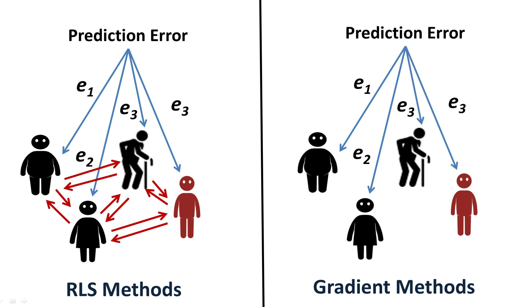

# Recursive Least Squares by predicting errors
This is a simple intivitve operation to solve linear equations using recursive least squares

Checkout the step by step video tutorial here: https://youtu.be/a6zgA_iNuEA

------------

Algorithmically this method is faster than matrix inversion due to the fewer operations requaried. However, in practise, it's hard to fairly compare this method with the already establisehd linear solvers because many opitimatization tricks have been done at the level of the hardware for matrix operations. We added a simple C++ implimentation using Eigen library to compare the performance of this method to the matrix inversion method.

### Illustration - RLS Error Prediction:

Inspired from the following post by whuber: https://stats.stackexchange.com/q/166718

### Comparision between how errors are shared among the inputs in Gradient based methods vs. RLS based methods

To run the code, you need to have numpy installed. 

### Fast Learning in Neural Networks (Real time optimization)

There is an example usage at the end of *RLS_Neural_Network.py* which showcases how this network can learn XOR data in a single iteration. Run the code and see the output.

**Advantages of using RLS for learning instead of gradient descent**
1. Fast learning and sample efficiency (can learn in one-shot).
2. Online Learning (suitable for real time learning).
3. No worries about local minima.

**Disadvantages:**
1. Computationally inefficient if the size of the input is big (Quadratic Complexity).
2. Sensitive to overflow and underflow and this can lead to unstability in some cases
3. The current implementation works with a single hidden unit neural network. It is not clear if adding more layers will be useful since learning only happens in the last layer 

