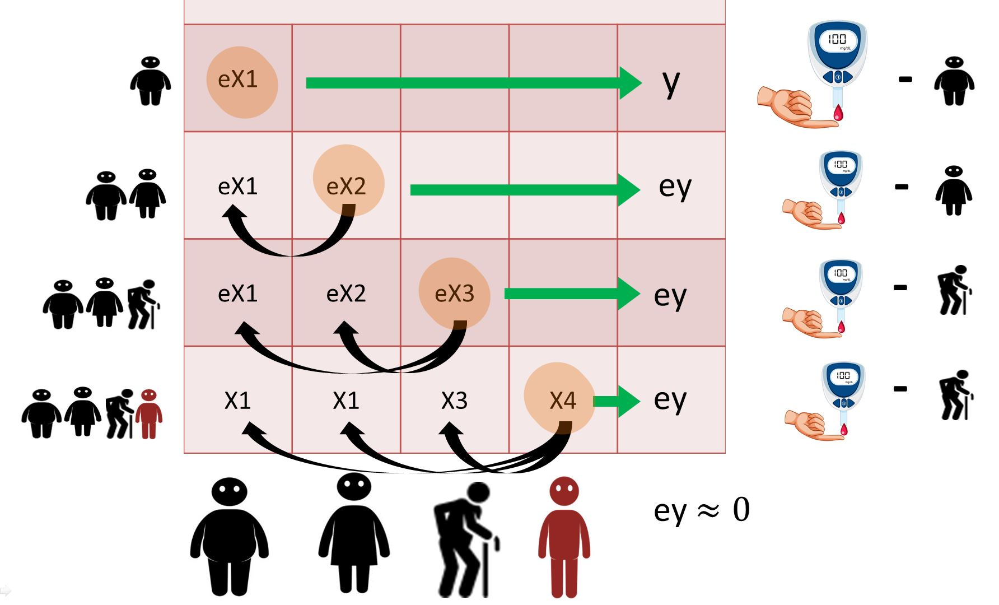

# Recursive Least Squares by predicting errors
This is a simple intivitve operation to estimate least squares for multiple variables 

Associated video tutorial is here: https://youtu.be/4vGaN1dTVhw

### Illustration - RLS Error Prediction:

Inspired from the following post by whuber: https://stats.stackexchange.com/q/166718

### Comparision between how errors are shared amaong the inputs in Gradient based methods vs. RLS based methods

To run the code, you need to have numpy installed. 

# One Shot Learning in Neural Networks

There is an example usage at the end of *RLS_Neural_Network.py* which showcases how this network can learn XOR data in one single iteration. Just run the code and see the output.

**Advantages of using RLS for learning instead of gradient descent**
1. Fast learning and sample efficiency (can learn in one-shot).
2. Online Learning (suitable for real time learning).
3. No worries about local minima.

**Disadvantages:**
1. Computationally inefficient if the size of the input is big (Quadratic Complexity).
2. Sensitive to overflow and underflow and this can lead to unstability in some cases
3. The current implementation works with a single hidden unit neural network. It is not clear if adding more layers will be useful since learning only happens in the last layer 

Currently we are working to overcome the limitations above by using a novel algorthim we call it **Predictive Hebbian Unified Neurons** or PHUN which shows promising results. For more info about PHUN visit us at: https://www.brainxyz.com/.

